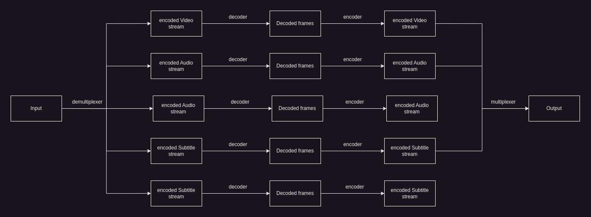

# PyTranscode
## Python bindings for ffmpeg
A pythonic way to build ffmpeg command line arguments for video transcoding. Provides an intuitive mapping and stream selection interface. Easily extendable and easy to use. Uses ffmpeg packages for linux.
## [Install ffmpeg for linux](https://ffmpeg.org/download.html#build-linux)
PyTranscode requires ffmpeg binaries to be installed on the linux to be used.
## ffmpeg command structure
```
ffmpeg [global_options] {[input_file_options] -i input_url} ..{[output_file_options] output_url} ...
```
## How ffmpeg works
The transcoding process in **`ffmpeg`** for each output can be described by the following diagram:

<br>
Ffmpeg working as described by `man ffmpeg`
> Ffmpeg calls the libavformat library to read input files and get packets containing encoded data from them. When there are multiple input files, ffmpeg tries to keep them synchronized by tracking lowest timestamp on any active input stream. 
<br><br>
Encoded packets are then passed to the decoder. The decoder produces uncompressed frames (raw video/PCM audio/...) which can be processed further by filtering. After filtering, the frames are passed to the encoder, which encodes them and outputs encoded packets. Finally those are passed to the muxer, which writes the encoded packets to the output file.
## Ffmpeg command line options
Ffmpeg command line options and order of implemetation priority

| Flag            | Type | Description | Priority |
| :--------------------------------- | :-- | :-------- | :------------ |
| -i | `input` | Input file url |`critical` |
| -y | `global` | Overwrite output files | `medium` |
| -n | `global` | Do not overwrite | `medium` |
| -stream_loop <u>number</u>| `input` | Number of times to loop input stream | `low` |
| -codec [<u>:stream_specifier] codec</u> | `input stream` `output stream` | Select encoder/ decoder | `critical` |
| -t <u>duration</u>| `input` | limit the duration of data read from the input file |`low` |
| -to <u>position</u> | `input` `output` | Stop writing the output or reading the input at <u>position</u>. <u>position</u> must be a time duration specification |`low` |
| -fs <u>limit_size</u>| `output` | Set the file size limit, expressed in bytes |`low` |
| -ss <u>position</u>| `input` `output` | Seeks in this input file to <u>position</u> or decodes but discards input until the timestamps reach <u>position</u>. <u>position</u> is a time duration specification  |`low` |
| -itsoffset <u>offset</u> | `input` | Set the input time offset |`low` |
| -target <u>type</u> | `output` | Specify target file type ("vcd", "svcd", "dvd", "dv", "dv50") | `medium` |
| -dn | `input` `output` | Blocks default stream selection/filtering behaviour | `low` |
| -frames[<u>:stream_specifier] framecount</u> | `output` `output stream` | Stop writing to the stream after <u>framecount</u> frames | `low` |
| -q[<u>:stream_specifier] q</u> | `output` `output stream` | Use fixed quality scale (VBR). The meaning of <u>q</u> is codec-dependent | `high` |
| -pre[<u>:stream_specifier] preset_name</u> | `output` `output stream` | Specify the preset for matching stream(s) | `high` |
| -stats | `global` | Print encoding progress/statistics| `high` |
| -progress <u>url</u> | `global` | Send program-friendly progress information to <u>url</u> | `low` |

